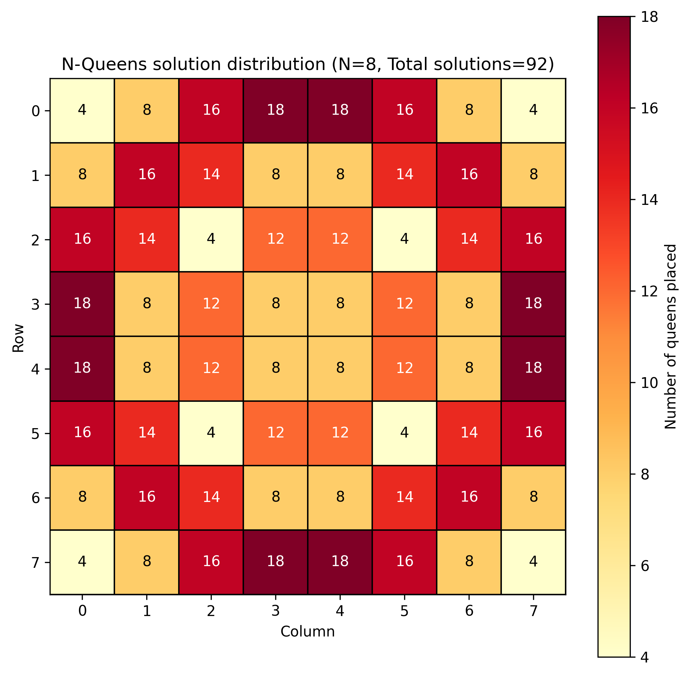

# N-Queens problem optimization

## Overview

The optimized version of the N-Queens problem solver enhances performance through parallelism using `OpenMP`, dynamic memory management for the board and write buffer, and efficient I/O handling. Bitwise operations are utilized for checking column and diagonal availability, reducing computational complexity. In contrast, the classic version solves the problem sequentially, with simpler memory handling and direct file writes, making it less efficient for larger values of `N`. While the optimized version offers faster execution, the optimizations primarily improve the efficiency and performance of the algorithm but do not change the fundamental asymptotic complexity, which is still `O(N!)` in the worst case.

##  Number of distinct solutions for the N-Queens problem

| N   | Number of Solutions |
| --- | ------------------- |
| 1   | 1                   |
| 2   | 0                   |
| 3   | 0                   |
| 4   | 2                   |
| 5   | 10                  |
| 6   | 4                   |
| 7   | 40                  |
| 8   | 92                  |
| 9   | 352                 |
| 10  | 724                 |
| 11  | 2,680               |
| 12  | 14,200              |
| 13  | 73,712              |
| 14  | 365,596             |
| 15  | 2,279,184           |
| 16  | 14,772,512          |
| 17  | 95,815,104          |
| 18  | 666,090,624         |
| 19  | 4,968,057,848       |
| 20  | 39,029,188,884      |

## Usage

To run the script for solving the problem, execute:

`./run_nqueens.sh N`

Replace `N` with the desired value.

## Example for N=8

### The problem has 92 unique solution with a size of solution space of 40320 

  

## The symmetry suggests that solutions can be derived from reflections/rotations of existing ones (reducing unique cases to 12).

  

